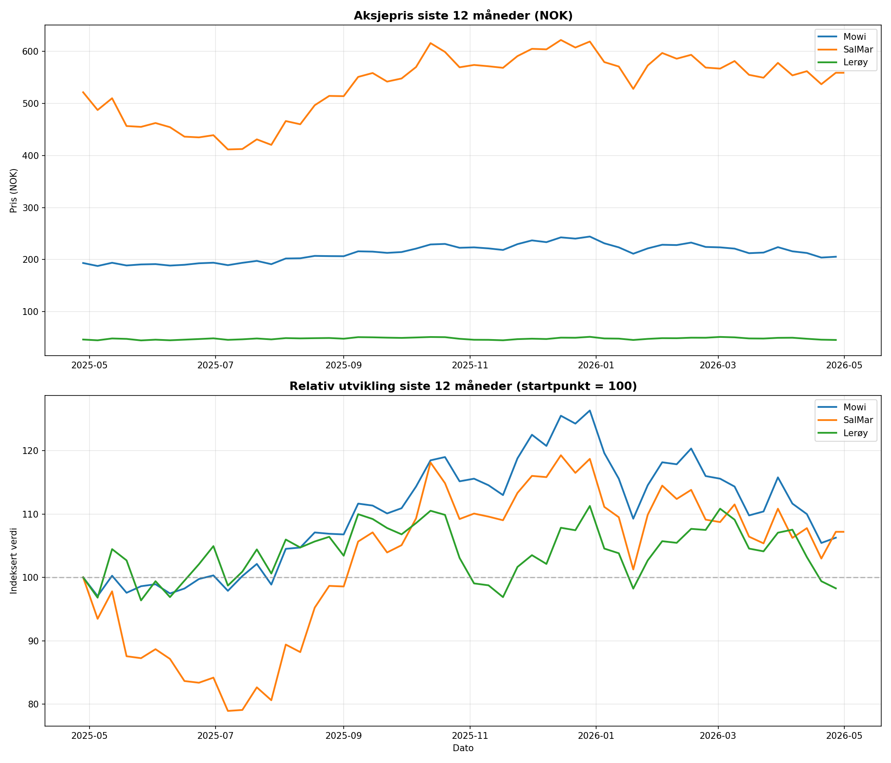

# Norwegian Salmon Industry – AI Market Analysis

A Python tool that fetches live stock data from Norway's three largest salmon companies (Mowi, SalMar, Lerøy) and uses AI to generate actionable market insights.

## What it does
- Fetches real-time stock prices from Yahoo Finance
- Generates two charts: absolute prices and relative performance
- Uses an LLM to analyze trends and provide insights for investors and industry players

## Tech stack
- Python
- pandas, matplotlib (data analysis and visualization)
- Groq API / LLM (AI-powered analysis)
- Yahoo Finance API (live market data)

## Setup
1. Clone the repository
2. Install dependencies: `pip install requests pandas matplotlib groq python-dotenv`
3. Create a `.env` file with your Groq API key: `GROQ_API_KEY=your_key_here`
4. Run: `python3 main.py`

## Example output

The tool generates a dual chart showing 12 months of stock performance and an AI-written market analysis.

## Background
Built as part of learning Python and AI integration, with a focus on applying data analysis to the aquaculture industry.